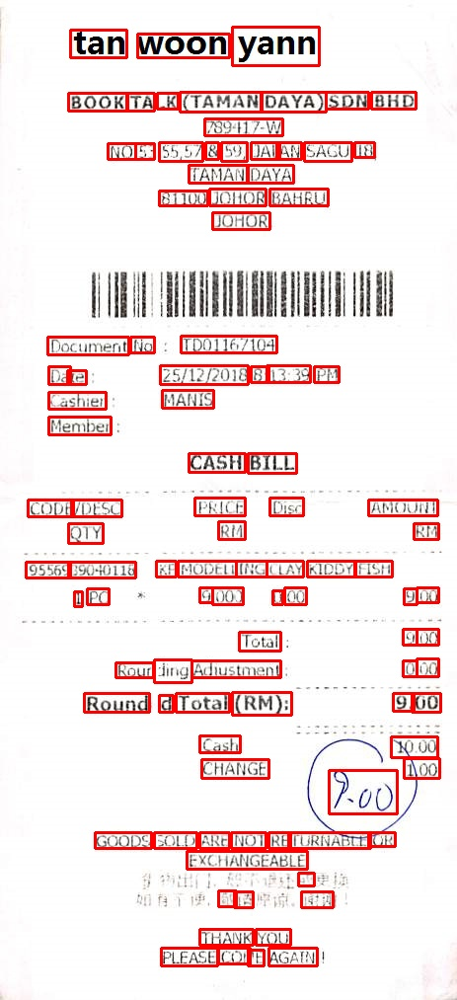
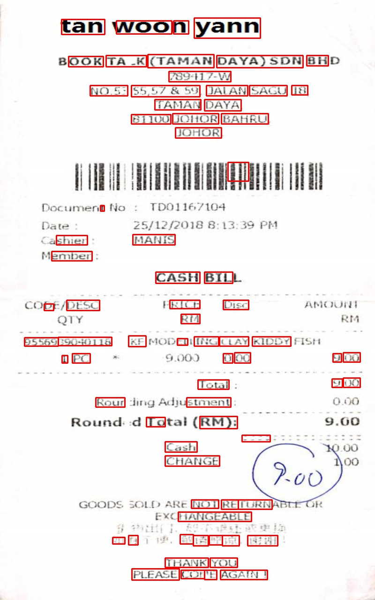
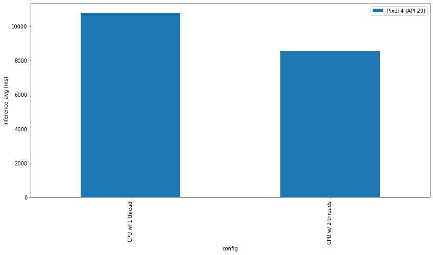

# CRAFT: Character-Region Awareness For Text detection

This is the github repository for converting craft pretrained model to tflite version and to provide an inference code using the tflite model.

The CRAFT model is proposed in this [paper](https://arxiv.org/abs/1904.01941).

# About CRAFT

The CRAFT model is a text detector that effectively detect text area by exploring each character region and affinity between characters. The bounding box of texts are obtained by simply finding minimum bounding rectangles on binary map after thresholding character region and affinity scores.


### About the files
 ```
 ├── scripts
     ├── pytorch_to_onnx.py      --> Converts pretrained pytorch model to onnx.
     ├── onnx_to_tflite.py       --> Converts Onnx to TFLITE
     ├── tflite_inference.py     --> Inference with converted tflite model.
     ├── craft_inference.py      --> Inference with Pytorch Pretrained model.
  
  Corresponding `ipynb` files are provided in `colabs` folder.

 ├── models
    ├──  craft_mlt_25k.pth       --> Model trained on SynthText, IC13, IC17
    ├──  craft.tflite            --> TFLite Model (Dynamic Quantization)
    ├──  craft_float16.tflite    --> TFLite Model(Float16 Quantization)
 ```
 
 Pretrained model can be downloaded from [here](https://drive.google.com/uc?export=download&id=1Jk4eGD7crsqCCg9C9VjCLkMN3ze8kutZ)
  
 ### Results
 
 ##### PYTORCH MODEL OUTPUT                                                  
 
 <div align=center></div>
 
 ##### TFLITE MODEL OUTPUT (DYNAMIC QUANTIZATION)
 
 <div align=center></div> 
 
 ##### TFLITE MODEL OUTPUT(FLOAT 16 QUANTIZATION)
 
 <div align=center></div> 
 
 ### TFLITE PROFILER BENCHMARKS
 
 ##### DYNAMIC QUANTIZED TFLITE MODEL
 
  <div align=center></div> 

### References

Some portions of the code are taken from [this repo](https://github.com/clovaai/CRAFT-pytorch)

## Citation
```
@inproceedings{baek2019character,
  title={Character Region Awareness for Text Detection},
  author={Baek, Youngmin and Lee, Bado and Han, Dongyoon and Yun, Sangdoo and Lee, Hwalsuk},
  booktitle={Proceedings of the IEEE Conference on Computer Vision and Pattern Recognition},
  pages={9365--9374},
  year={2019}
}
```
